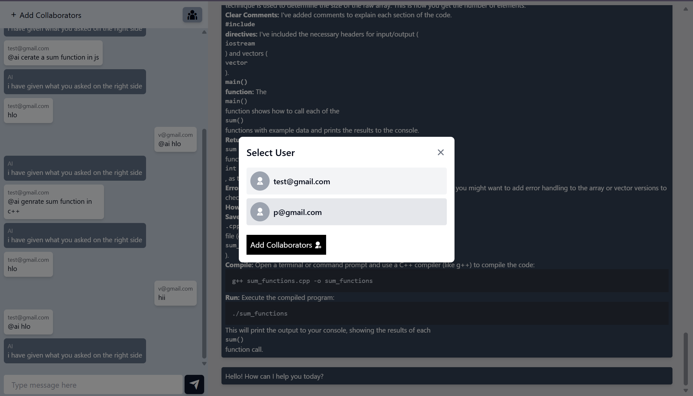

# ThinkSync - Real-time Collaborative Platform

ThinkSync is a real-time collaborative platform that allows teams to work together on projects, communicate in real-time, and leverage AI assistance for enhanced productivity.


## Table of Contents
- [Overview](#overview)
- [Features](#features)
- [Screenshots](#screenshots)
- [Technology Stack](#technology-stack)
- [Project Structure](#project-structure)
- [Installation & Setup](#installation--setup)
    - [Prerequisites](#prerequisites)
    - [Frontend Setup](#frontend-setup)
    - [Backend Setup](#backend-setup)
    - [Environment Variables](#environment-variables)
- [API Documentation](#api-documentation)
- [Components & Architecture](#components--architecture)
- [Authentication Flow](#authentication-flow)
- [Real-time Communication](#real-time-communication)
- [AI Integration](#ai-integration)
- [Security Features](#security-features)
- [Contributing](#contributing)
- [License](#license)

## Overview

ThinkSync is a collaborative platform that enables users to create projects, collaborate in real-time, and communicate through integrated messaging with AI assistance. It consists of a React frontend and Node.js backend with MongoDB database.

## Features

- **User Authentication**: Secure registration and login system
- **Project Management**: Create, view, and manage collaborative projects
- **Real-time Messaging**: Instant communication within projects
- **AI Assistant**: Built-in AI assistance with Google Gemini integration
- **Collaborative Workspace**: Real-time updates and notifications
- **Encrypted Messages**: End-to-end encrypted communication
- **Responsive Design**: Works on desktop and mobile devices

## Screenshots

### Authentication


### Project Management


### Collaboration



### Communication


## Technology Stack

### Frontend
- **React**: UI library
- **React Router**: Navigation
- **Socket.IO Client**: Real-time communication
- **Axios**: API requests
- **Tailwind CSS & DaisyUI**: Styling
- **Vite**: Build tool

### Backend
- **Node.js & Express**: Server-side framework
- **MongoDB**: Database (with Mongoose ORM)
- **Socket.IO**: Real-time communication
- **Redis**: Caching and token blacklisting
- **JWT**: Authentication
- **Google AI (Gemini)**: AI assistant integration

## Project Structure

The project is organized into Frontend and Backend directories:

### Frontend Structure
```
/Frontend
├── public/             # Static assets
├── src/
│   ├── assets/         # Application assets
│   ├── auth/           # Authentication components
│   ├── components/     # Reusable UI components
│   │   ├── headerFooter/  # Layout components
│   │   ├── projectComponents/ # Project-related components
│   │   └── ui/         # UI elements
│   ├── config/         # Config files for services
│   ├── context/        # React context providers
│   ├── ErrorBoundary/  # Error handling
│   ├── lib/            # Utility functions
│   ├── routes/         # Routing configuration
│   ├── screens/        # Main page components
│   ├── App.jsx         # Main application component
│   ├── index.css       # Global styles
│   └── main.jsx        # Entry point
```

### Backend Structure
```
/Backend
├── controllers/           # Route controllers
│   ├── ai.controller.js
│   ├── project.controller.js
│   ├── user.controller.js
│   └── ...
├── db/                    # Database connection
│   └── db.js
├── middlewares/           # Express middlewares
│   └── user.auth.middleware.js
├── models/                # Mongoose models
│   ├── message.model.js
│   ├── project.model.js
│   ├── user.model.js
│   └── ...
├── routes/                # API routes
├── services/              # Business logic
├── validators/            # Input validation
├── app.js                 # Express application setup
└── server.js              # Server entry point with Socket.IO setup
```

## Installation & Setup

### Prerequisites
- Node.js (v16 or higher)
- npm or yarn
- MongoDB
- Redis

### Frontend Setup
1. Navigate to the Frontend directory:
     ```bash
     cd ThinkSync/Frontend
     ```

2. Install dependencies:
     ```bash
     npm install
     ```

3. Set up environment variables:
     - Create a `.env` file based on `.envsample`
     - Configure the API URL: `VITE_BASE_API_URL=http://localhost:3000`

4. Run the development server:
     ```bash
     npm run dev
     ```

### Backend Setup
1. Navigate to the Backend directory:
     ```bash
     cd ThinkSync/Backend
     ```

2. Install dependencies:
     ```bash
     npm install
     ```

3. Set up environment variables:
     - Create a `.env` file
     - Configure the required variables (see Environment Variables section)

4. Run the server:
     ```bash
     npm start
     ```

### Environment Variables

#### Frontend (.env)
```
VITE_BASE_API_URL=http://localhost:3000
```

#### Backend (.env)
```
PORT=3000
MONGO_URI=your_mongodb_connection_string
JWT_SECRET=your_jwt_secret_key
REDIS_HOST=your_redis_host
REDIS_PORT=your_redis_port
REDIS_PASSWORD=your_redis_password
GOOGLE_AI_KEY=your_google_ai_api_key
ENCRYPTION_KEY=32_character_encryption_key_for_messages
```

## API Documentation

### Authentication Routes
- **Register**: `POST /users/register`
- **Login**: `POST /users/login`
- **Logout**: `GET /users/logout`
- **Profile**: `GET /users/profile`

### Project Routes
- **Create Project**: `POST /project/create-project`
- **Get Projects**: `GET /project/get-projects`
- **Add Users**: `PUT /project/add-user`
- **Get Project**: `GET /project/get-project/:projectId`
- **Delete Project**: `DELETE /project/delete-project/:projectId`

### Message Routes
- **Get Messages**: `GET /api/messages/:projectId`

### AI Routes
- **Get AI Response**: `GET /ai/get-result?prompt=yourprompt`

## Components & Architecture

- **User Authentication**: Protected routes with UserAuth component
- **Project Management**: Create, join, and manage projects
- **Real-time Messaging**: Socket.IO for instant communication
- **Database Models**: User, Project, and Message schemas
- **Context API**: Global state management with userContext

## Authentication Flow

1. User registers or logs in to receive a JWT token
2. Token is stored in localStorage and user state is updated
3. Protected routes verify the token using isLogin middleware
4. On logout, the token is blacklisted in Redis

## Real-time Communication

Socket.IO enables real-time features:
- Project messaging with encrypted communications
- Live updates when project changes occur
- AI assistant integration in chat with "@ai" prefix

## AI Integration

Google's Gemini AI integration provides:
- Contextual assistance in project chats
- Code suggestions and problem-solving
- Development task support

## Security Features

- Password hashing with bcrypt
- JWT authentication with token blacklisting
- Message encryption using AES-256-CBC
- Input validation and sanitization
- Proper error handling for security

## Contributing

We welcome contributions! Please follow these steps:
1. Fork the repository
2. Create a feature branch
3. Make changes and test
4. Submit a pull request

## License

This project is licensed under the MIT License.
